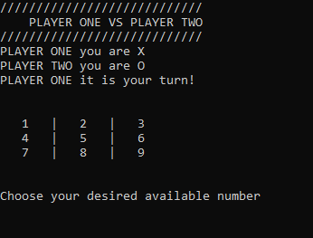

# Tic Tac Toe Project
In this project, i had to create a Tic Tac Toe game using only Ruby in order to increase my knowledge on the OOP concepts.
This project was split in 4 milestones, which were:
- Setting up the project
- Designing the user interface
- Creating the game logic
- Writing the game instructions

## Built With

- Ruby
- Rubocop

## Screenshots

### Prerequisites

- Browser (Google Chrome, Mozilla Firefox, Safari or any other browser)

### Setup
- Open Terminal

- Run git clone https://github.com/KennyUTN/Tic-Tac-Toe.git
- Run `cd Tic-Tac`
- Run `ruby bin/main`

### Game instructions
- Both players choose their names to play against each other
- A 3x3 grid is displayed on the terminal and the first player chooses a number to place his symbol on that number's position
- The players take turns in order to try to make an uninterrupted row, column or diagonal.
- The player which does that first wins!
- If all spaces are chosen and there is no winner, it is considered a draw
- On both situations above, there is the option to restart the game
- Have fun!

## Steps to validate code using Rspec
- Once you have clone the repository make sure that you have Rspec install by running rspec --version
- If you do not have Rspec installed do so by following the Instructions [here](https://medium.com/@amliving/my-rails-rspec-set-up-6451269847f9)
- Then move to the directory spec and run this command 'rspec tic_tac_toe_spec_test.rb'

### Authors

👤 **Juan Ignacio Asis**

- Github: [@KennyUTN](https://github.com/Berabjesus)
- Twitter: [@Kenny11614766](https://twitter.com/Kenny11614766)
- Linkedin: [Ignacio Asis](https://www.linkedin.com/in/ignacio-asis-b8214b183/)

## 🤝 Contributing

Contributions, issues and feature requests are welcome!

Feel free to check the [issues page](https://github.com/KennyUTN/Tic-Tac-Toe/issues).

## Show your support

Give a ⭐️ if you like this project!

## Acknowledgments

- Microverse
- GitHub
- TheOdinProject
- Ruby

## 📝 License

This project is [MIT](lic.url) licensed.
